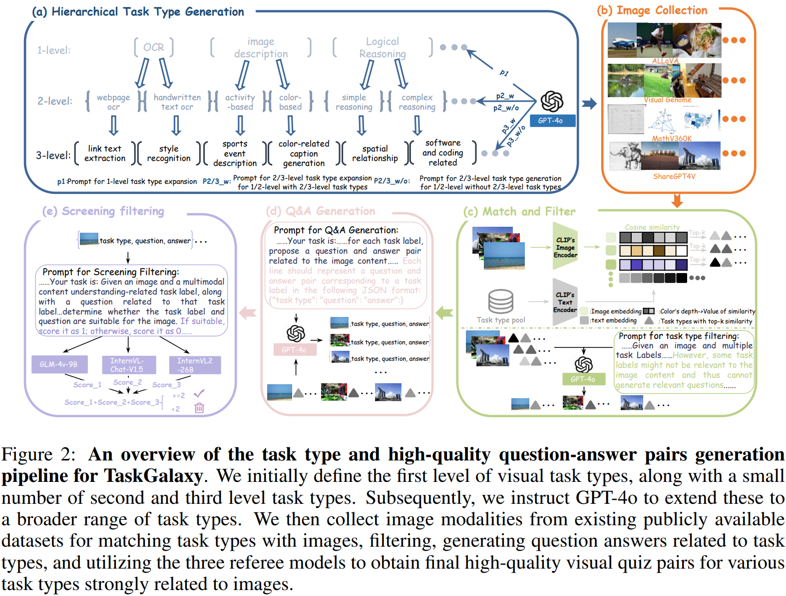

# TaskGalaxy
[ICLR 2025] Scaling Multi-modal Instruction Fine-tuning with Tens of Thousands Vision Task Types

## Abstract
Multimodal visual language models are gaining prominence in open-world appli- cations, driven by advancements in model architectures, training techniques, and high-quality data. However, their performance is often limited by insufficient task- specific data, leading to poor generalization and biased outputs. Existing efforts to increase task diversity in fine-tuning datasets are hindered by the labor-intensive process of manual task labeling, which typically produces only a few hundred task types. To address this, we propose TaskGalaxy, a large-scale multimodal instruc- tion fine-tuning dataset comprising 19,227 hierarchical task types and 413,648 samples. TaskGalaxy utilizes GPT-4o to enrich task diversity by expanding from a small set of manually defined tasks, with CLIP and GPT-4o filtering those that best match open-source images, and generating relevant question-answer pairs. Multiple models are employed to ensure sample quality. This automated pro- cess enhances both task diversity and data quality, reducing manual interven- tion. Incorporating TaskGalaxy into LLaVA-v1.5 and InternVL-Chat-v1.0 models shows substantial performance improvements across 16 benchmarks, demonstrat- ing the critical importance of task diversity.

## Data Pipeline

- [TaskGalaxy Dataset Download](https://huggingface.co/datasets/CverCJK-huggingface/TaskGalaxy)

## Image Collection
### Images Download Links
#### MathV360K
- [MathV360K Dataset](https://huggingface.co/datasets/Zhiqiang007/MathV360K)
- Download: `data_images.zip`
- Path: `a_math_related/`

#### ALLAVA
- Main file contains the following download commands:
  - `download_laion.sh`
  - `download_vflan.sh`
- Downloaded paths:
  - `allava_laion/images`
  - `allava_vflan/images_vflan`

#### VG (Visual Genome)
- [VG_100K_2 Images (1)](https://cs.stanford.edu/people/rak248/VG_100K_2/images.zip)
- [VG_100K_2 Images (2)](https://cs.stanford.edu/people/rak248/VG_100K_2/images2.zip)
- Download paths:
  - `a_visual_genome/VG_100K`
  - `a_visual_genome/VG_100K_2`

#### shareGPT4V
- Path: `a_sharegpt4v_data/coco_train2017`
  - [COCO 2017 Train Images](https://images.cocodataset.org/zips/train2017.zip)
- Additional datasets (download links available in the main file):
  - `a_sharegpt4v_data/sam_images`: [Link in `sam_images/sampath.sh`](https://ai.meta.com/datasets/segment-anything-downloads/)
  - For the following datasets and TaskGalaxy dataset, please refer to the [TaskGalaxy Dataset on Hugging Face](https://huggingface.co/datasets/CverCJK-huggingface/TaskGalaxy/):
    - `a_sharegpt4v_data/ocr_vqa_images`
    - `a_sharegpt4v_data/share_textvqa_images`
    - `a_sharegpt4v_data/text_vqa_train_images`
    - `a_sharegpt4v_data/web-celeberity_images`
    - `a_sharegpt4v_data/web-landmark_images`
    - `a_sharegpt4v_data/wikiart_images`

## Dataset Generation Introduction

### Step 1: Task Type Generation
Run the `hierarchical_task_type_generation.py` script to generate a hierarchical task structure using GPT-4. The main directory will be labeled as `Tasktype`. To extract the specific task types, run the `create_task_txt.py` script. This will save the hierarchical task types in the `tasktype.txt` file, with each task type represented in a hierarchical format, separated by the `~` symbol.

```bash
python hierarchical_task_type_generation.py
python create_task_txt.py
```
### Step 2: Image Collection
Follow the image collection process as described in the Image Collection section above.

### Step 3: Task Type Matching and Filtering
First, run the clip_match.py script to match each image with its corresponding task type. To further refine the task types and ensure they match the image content more closely, run the gpt4o_filter.py script to filter out non-matching task types. Finally, execute the prepare_forstep4.py script to adjust the file format for question-answer generation in Step 4.

```bash
python clip_match.py
python gpt4o_filter.py
python prepare_forstep4.py
```

### Step 4: Question-Answer Generation
Run the gpt4o_qagenerate.py script to generate questions and answers for each task type associated with the images. Afterward, run the prepare_forstep5.py script to adjust the file format for the quality filtering process in Step 5.

```bash
python gpt4o_qagenerate.py
python prepare_forstep5.py
```

### Step 5: Quality Scoring and Final Selection
Use three open-source models to score the question-answer pairs for each task type and its corresponding image. Run the respective .py scripts for each model to obtain the scores. After scoring, execute the highdata_generate.py script to aggregate the scores and select samples with a score greater than or equal to 2 as the final samples for TaskGalaxy. Finally, run the change_style_forllava.py script to adjust the format of the selected samples to match the LLava fine-tuning data format.

```bash
python infer_glm4v_score_1.py
python infer_internVL_score_1.py
python infer_internVL2_26B_score_1.py
python highdata_generate.py
python change_style_forllava.py
```
